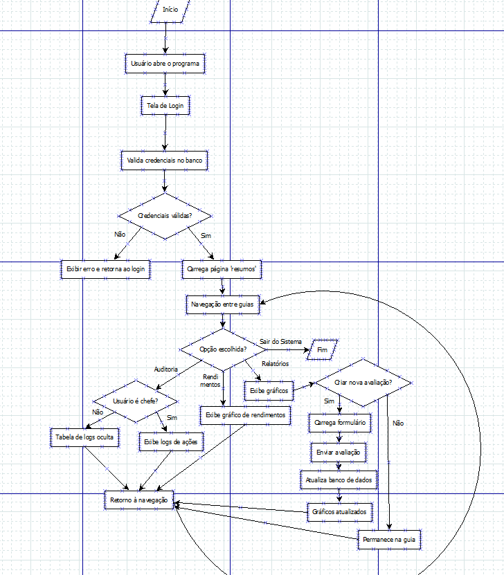
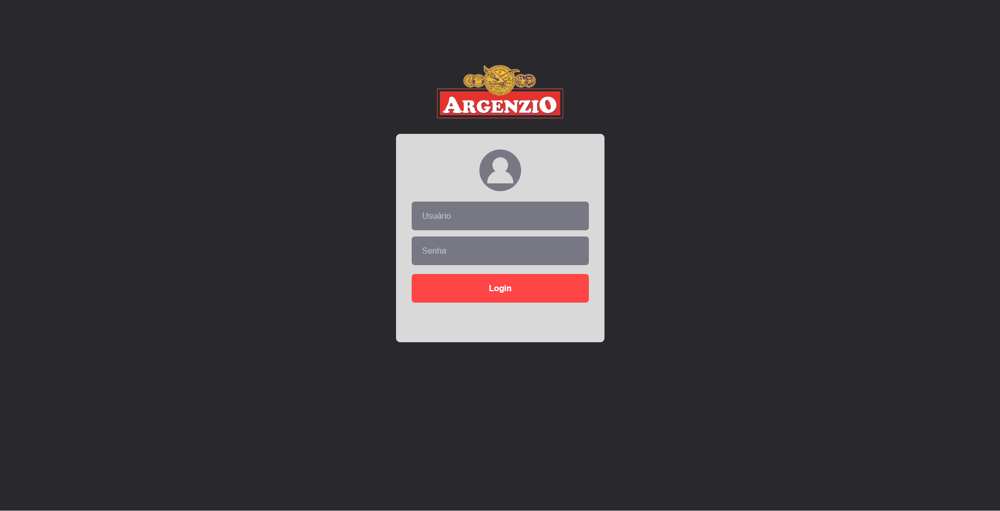

# 💻 Desenvolvimento de Software Corporativo

<div align="right">
    
</div>

4º Semestre do curso de Ciência da Computação
UNIFEOB

## 👥 Equipe
- Enzo Daniel Abreu
- Gabriel da Silva Freitas
- José Carlos Pereira Neto
- Lucas Paulino Gomes
- Thierry Antonello Pengo

## 📚 Sumário
- [Sobre o Projeto](#-sobre-o-projeto)
- [Empresa beneficiada](#-empresa-beneficiada)
- [Estrutura de Dados](#-estrutura-de-dados)
- [Desenvolvimento de Software Corporativo - Aplicação Electron](#-desenvolvimento-de-software-corporativo---aplicação-electron)
- [Segurança e Auditoria](#-segurança-e-auditoria)
- [Sistemas Operacionais](#%EF%B8%8F-sistemas-operacionais)
- [Arquitetura da Aplicação](#-arquitetura-da-aplicação)
- [Como acessar o repositório](#-como-acessar-o-repositório)

## 📦 Sobre o projeto

O projeto integrado deste semestre visa ao desenvolvimento de uma aplicação desktop do tipo software corporativo, utilizando os conceitos e tecnologias aprendidos durante o módulo, para a criação de um programa que envolva:

- **Estrutura de Dados**: o estudo de estruturas como pilhas, listas, filas, grafos e árvores hash é fundamental para a organização lógica e eficiente das informações dentro de um sistema. Cada estrutura possui características próprias que influenciam diretamente na forma como os dados são armazenados, acessados e manipulados. Além disso, a compreensão de conceitos de complexidade algorítmica — como os tempos de inserção, busca e remoção — permite escolher a estrutura mais adequada para cada problema, garantindo um desenvolvimento de código mais otimizado, escalável e com melhor desempenho na prática;

- **Segurança e Auditoria**: criação de papéis de usuários com atribuição de permissões específicas para cada um, considerando o princípio do menor privilégio e restringindo ou permitindo as funcionalidades do sistema conforme a função. Além disso, a criação de registros de auditoria tem como finalidade manter o controle sobre as atividades de cada usuário no sistema e possibilitar a prevenção de ataques;

- **Aplicação Electron**: este framework tem se tornado bastante comum no desenvolvimento de aplicações desktop, sendo utilizado na criação de diversos aplicativos e sistemas famosos, como Google Chrome, ChatGPT e Netflix. Sua integração com Express.js e EJS permite o desenvolvimento de um sistema simples, seguro e eficiente;

- **Sistemas Operacionais**: ao exportar a aplicação para diferentes S.O., como Windows, Linux e macOS, é possível alcançar um número maior de usuários, abrangendo variados sistemas. Além disso, ao realizar a virtualização de sistemas operacionais com programas como Hyper-V e VirtualBox, reduz-se a quantidade de máquinas necessárias para a instalação e teste de novos S.O.

### 🏢 Empresa beneficiada

A empresa beneficiada com o desenvolvimento deste projeto é a Laticínios Trevo Casa Branca LTDA, mais conhecida como Argenzio.
O projeto consiste na criação de um sistema corporativo de mostragem de relatórios referentes ao rendimento das vendas, desempenho dos produtos e dos vendedores e avaliações dos clientes. Essas avaliações incluem uma nota atribuída (de 0 a 10) e um comentário descritivo, permitindo identificar percepções mais detalhadas sobre atendimento, produtos e vendas, com o objetivo de obter insights valiosos que auxiliem na tomada de decisões estratégicas e na melhoria contínua dos processos internos.

### 🧩 Estrutura de Dados

Neste módulo, aprendemos a criar diferentes tipos de arranjos de dados, englobando pilhas, listas, filas, árvores hash e grafos.

No projeto de nossa equipe, chegou-se à conclusão de que a implementação de alguma dessas estruturas seria inviável para a arquitetura e as funcionalidades planejadas pelo grupo, considerando as necessidades da empresa beneficiada.

### ⚡ Desenvolvimento de Software Corporativo - Aplicação Electron

Neste módulo, aprendemos a utilizar o Electron integrado com o framework web minimalista Express e o uso do HTML dinâmico proporcionado pelo EJS para desenvolver uma aplicação desktop moderna, modular e de fácil manutenção. Essa integração possibilitou a criação de interfaces interativas e responsivas, além de permitir a comunicação eficiente entre o front-end e o back-end da aplicação. Com isso, foi possível estruturar o sistema de forma organizada, garantindo segurança, desempenho e escalabilidade. Além disso, o uso dessas tecnologias facilitou a manipulação de dados em tempo real e a geração de relatórios dinâmicos dentro da própria aplicação.

Além disso, foi utilizado o Knex.js, um construtor de consultas SQL para Node.js, configurado para estabelecer conexão com o banco de dados PostgreSQL, utilizando o client 'pg'. Por meio dele, as queries foram construídas de forma segura e parametrizada, evitando vulnerabilidades como SQL Injection. O Knex foi empregado tanto para buscar os dados das tabelas e preencher os gráficos dos relatórios de vendas, produtos e avaliações, quanto para inserir novas avaliações na tabela de clientes.
A autenticação dos usuários também foi implementada através de uma consulta à tabela de usuários do PostgreSQL, garantindo controle de acesso e segurança nas operações do sistema.

### 🪪 Segurança e Auditoria

Neste módulo, foram abordados conceitos e práticas fundamentais de segurança da informação e controle de acesso dentro de aplicações corporativas. A aplicação foi desenvolvida com mecanismos de autenticação e autorização baseados em papéis de usuários, garantindo que cada perfil possua apenas as permissões necessárias, conforme o princípio do menor privilégio. Além disso, foram implementados registros de auditoria para armazenar informações sobre as ações executadas por cada usuário, possibilitando o rastreamento de atividades, identificação de comportamentos suspeitos e prevenção de ataques ao sistema. Essas medidas contribuem para a integridade dos dados e a confiabilidade geral da aplicação.

Para o nosso sistema, foram criados dois papéis de usuários:

- O usuário chefe possui todas as permissões de banco de dados, exceto a de superusuário, podendo visualizar todos os relatórios, criar novas avaliações e consultar os registros de auditoria;

- O usuário atendente possui permissões apenas para executar seleções (*SELECT*), inserções (*INSERT*) e exclusões (*DELETE*) nos relatórios, não tendo acesso aos registros de auditoria.

Os registros de auditoria foram implementados por meio de um procedimento armazenado (*stored procedure*), responsável por inserir dados na tabela log_auditoria, contendo as seguintes informações: nome da tabela, tipo de operação (*INSERT, UPDATE ou DELETE*), dados antigos, dados novos, usuário responsável e horário da modificação.
A partir desse procedimento, foram criados gatilhos (*triggers*) para todas as tabelas do banco, que são acionados automaticamente sempre que ocorre uma inserção (*INSERT*), atualização (*UPDATE*) ou exclusão (*DELETE*), garantindo o monitoramento contínuo e detalhado das alterações realizadas no sistema.

### 🖥️ Sistemas Operacionais

Neste módulo, aprendemos o conceito de virtualização e como aplicá-lo na prática utilizando ferramentas como o Hyper-V e o VirtualBox. Por meio do electron-builder, é possível exportar uma versão da aplicação para o sistema Linux e testá-la em um ambiente virtualizado no Hyper-V, verificando seu funcionamento e compatibilidade em diferentes sistemas operacionais.
Essa prática permite compreender melhor as particularidades de cada sistema operacional (S.O.), bem como a importância de garantir a portabilidade e estabilidade do software em múltiplas plataformas. Assim, fica evidente que o domínio dos conceitos de virtualização e sistemas operacionais é essencial para o desenvolvimento de sistemas corporativos robustos, acessíveis e multiplataforma.

Ao estudar o funcionamento do Linux, aprendemos também sobre os sistemas de código aberto (open source) e suas diversas distribuições, que em sua maioria não possuem interface gráfica e exigem o uso direto do terminal. Essa experiência foi fundamental para compreender a estrutura interna de um sistema operacional, os princípios de administração de sistemas e a execução de comandos para navegação, manipulação de arquivos e controle de processos.
O aprendizado dos comandos de terminal Linux mostrou-se essencial não apenas para o teste e manutenção de ambientes virtuais, mas também para o entendimento mais profundo do funcionamento do software, aprimorando a autonomia e a capacidade técnica da equipe no desenvolvimento de aplicações multiplataforma.

## 📁 Arquitetura da Aplicação
1. **Estrutura das pastas**
    ```
    modulo-software-corporativo-unifeob/
    ├── docs/
    │   ├── insertsTeste.sql
    │   ├── README.md
    │   ├── scriptLogAuditoria.sql
    │   ├── scriptPI-PostgreSQLv1111.sql
    │   └── scriptTriggersAuditoria.sql
    ├── node_modules
    ├── readme-images/
    │   └── logo_unifeob.png
    ├── renderer/
    │   ├── public/
    │   │   ├── assets/
    │   │   │   └── Logo_Argenzio.png
    │   │   ├── css/
    │   │   │   ├── styledescricaoprodutos.css
    │   │   │   ├── stylelog.css
    │   │   │   ├── stylelogin.css
    │   │   │   ├── stylemenu.css
    │   │   │   ├── stylenova_avaliacao.css
    │   │   │   └── stylerelatorios.css
    │   │   └── js/
    │   │       ├── loginScript.js
    │   │       ├── menu-active.js
    │   │       └── relatoriosScript.js
    │   └── view/
    │       ├── auditoria.ejs
    │       ├── descricaoProduto.ejs
    │       ├── login.ejs
    │       ├── nova_avaliacao.ejs
    │       ├── relatorios.ejs
    │       └── resumos.ejs
    ├── server/
    │   ├── config/
    │   │   └── connection.js
    │   ├── controllers/
    │   │   ├── auditoria.js
    │   │   ├── avaliacaoClientes.js
    │   │   ├── login.js
    │   │   ├── produtos.js
    │   │   ├── secureStorage.js
    │   │   └── vendedores.js
    │   ├── middlewares/
    │   │   └── checkRole.js
    │   ├── models/
    │   │   └── role.js
    │   ├── routers/
    │   │   ├── auditoria.js
    │   │   ├── login.js
    │   │   ├── produtos.js
    │   │   ├── relatorios.js
    │   │   ├── resumos.js
    │   │   ├── router.js
    │   │   └── vendedores.js
    │   ├── services/
    │   │   └── crypto.js
    │   └── app.js
    ├── .env
    ├── .gitignore
    ├── main.js
    ├── package-lock.json
    ├── package.json
    ├── preload.js
    └── README.md
    ```
2. **Módulos utilizados**
   
    2a. devDependecies `npm i --save-dev`

        - EJS: 3.1.10

        - electron: 37.8.0

        - express: 5.1.0

        - express-session: 1.18.2

    2b. dependences `npm i --save`

        - dotenv: 17.2.3

        - keytar: 7.9.0

        - knex: 3.1.0

        - pg: 8.16.3
   
        - swagger-ui-express: 5.0.1
   
        - yamljs: 0.3.0


## Fluxo geral

    
## 🧭 Como acessar o repositório

1. 📂 **Acesso ao Repositório**

    - Para clonar o repositório localmente, utilize o comando:

        git clone https://github.com/aspiringluke/modulo-software-corporativo-unifeob.git


    - Após a clonagem, acesse a pasta do projeto:

        ```
        cd modulo-software-corporativo-unifeob
        ```

2. ⚙️ **Instalação de Dependências**

    💡 **Certifique-se de ter o Node.js e o npm instalados na máquina antes de prosseguir.**
   
    Antes de executar a aplicação, é necessário criar o package.json e instalar as dependências do projeto.
    No terminal, execute:

    ```
    npm init -y
    ```
    Esse comando irá criar o package.json que contém informações básicas do projeto e uma lista das dependências utilizadas

    ```
    npm install
    ```
    Esse comando irá instalar no package.json as dependências necessárias colocando seu nome ao lado e indicando se vai instalar a versão de desenvolvimento ou não
   
    - Dependências:
        - electron: 
        ``` 
        npm i electron --save-dev
        ```

        - express:
        ``` 
        npm i express --save-dev
        ```

        - ejs:
        ``` 
        npm i ejs --save-dev
        ```

        - express-session:
        ``` 
        npm i express-session --save-dev
        ```

        - dotenv:
        ``` 
        npm i dotenv --save
        ```
        
        - knex:
        ```
        npm i knex --save
        ```
        
        - keytar:
        ``` 
        npm i keytar --save
        ```

        - pg:
        ``` 
        npm i pg --save
        ```

        - swagger:
        ```
        npm i swagger-ui-express --save
        ```
    
       - yamljs:
       ```
       npm i yamljs --save
       ```


4. 💻 **Execução da Aplicação em Ambiente de Desenvolvimento**

    - Para iniciar o sistema em modo de desenvolvimento, utilize o comando:
    
      ```
      npm start
      ```
  
      Isso iniciará o Electron e abrirá a aplicação desktop.

5. 🏗️ **Geração de Executável (Build)**

    - Para gerar a versão final da aplicação, utilize o Electron Builder com o comando:

      ```
      npm run build
      ```


    - O instalador será gerado na pasta:

      ```/dist```


      Aqui você pode especificar o nome do arquivo gerado, a plataforma (Windows, Linux, macOS) e outras observações, como permissões ou configurações adicionais.

6. 🔑 **Acesso ao Sistema**

    Após a instalação, o sistema solicitará autenticação de usuário.
    Use as credenciais padrão de teste:

    
    - Usuário chefe
   
      ***Usuário:*** chefeTeste
  
      ***Senha:*** chefe123

    - Usuário atendente
   
      ***Usuário:*** atendTeste
  
      ***Senha:*** atend123


    Essas credenciais podem ser modificadas diretamente no banco de dados PostgreSQL, conforme os papéis definidos (usuário chefe e atendente).

7. 🧰 **Requisitos do Sistema**

- Node.js: versão recomendada 18.x ou superior

- npm: versão recomendada 9.x ou superior

- Banco de dados: PostgreSQL 17.0

- Sistema operacional compatível: Windows, Linux, macOS

## Exemplo de Uso

Nesta seção, será demonstrado como o sistema pode ser utilizado em um cenário real, apresentando o fluxo de interação do usuário, a visualização dos relatórios e o procedimento para registrar novas avaliações ou consultar informações já existentes.



<<<<<<< HEAD
Após iniciar o sistema com ```npm start```, a tela de login será inicializada. Após fazer a autenticação com sucesso, o usuário será redirecionado para página de resumos...
=======


>>>>>>> main
