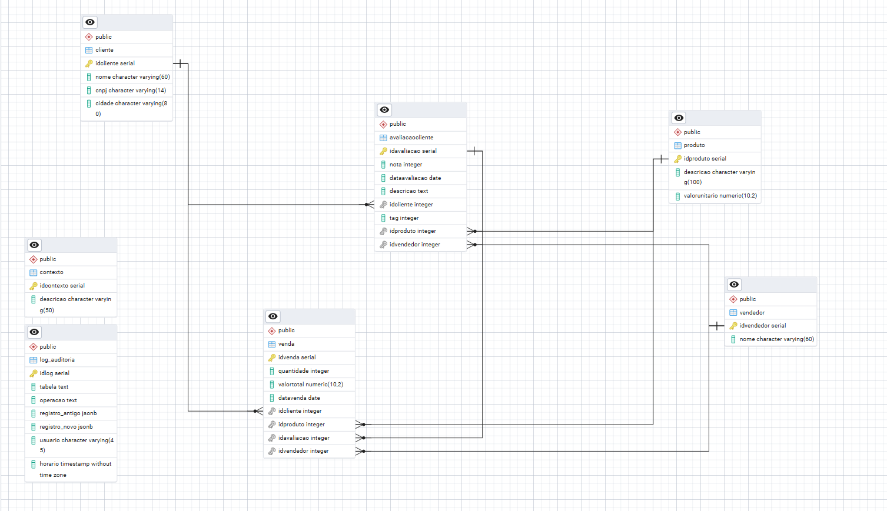
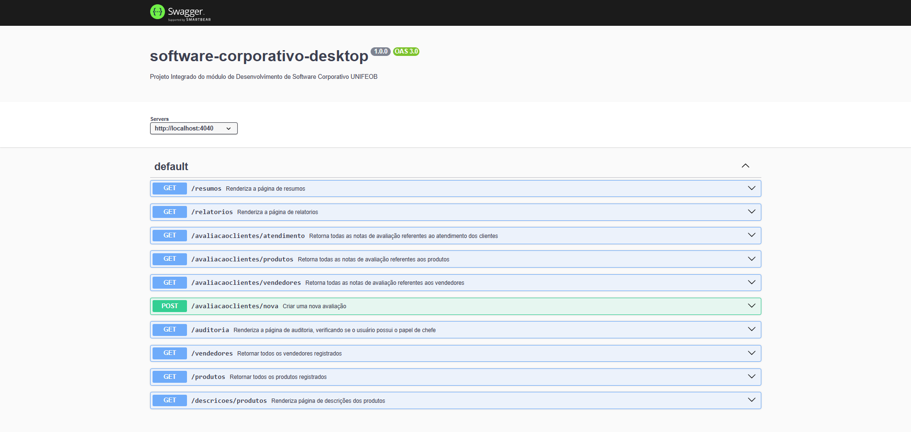

# 📄 Documentos
Essa seção está reservada para arquivos relacionados à fase inicial de planejamento da estrutura do banco de dados. Poderá ser encontrado scripts SQL de criação das tabelas que compõem a estrutura do banco PostgreSQL e, também, dos scripts relacionados com a funcionalidade de auditoria

## 📚 Sumário
- [Modelo lógico](#-modelo-lógico)
- [Scripts SQL - Criação das tabelas e Gerenciamento de permissões](#-scripts-sql---criação-das-tabelas-e-gerenciamento-de-permissões)
- [Scripts SQL - Lógica de auditoria](#-scripts-sql---lógica-de-auditoria)
- [Documentação API](#documentação-da-api)

## 💡 Modelo lógico


## 🔓 Scripts SQL - Criação das tabelas e Gerenciamento de permissões

```sql
-- Criação do banco de dados do PI
CREATE DATABASE sistema_argenzio;

CREATE TABLE cliente (
    idCliente SERIAL PRIMARY KEY,
    nome VARCHAR(60),
    cnpj VARCHAR(14),
    cidade VARCHAR(80)
);

CREATE TABLE produto (
    idProduto SERIAL PRIMARY KEY,
    descricao VARCHAR(100),
    valorUnitario DECIMAL(10, 2)
);

CREATE TABLE avaliacaocliente (
    idAvaliacao SERIAL PRIMARY KEY,
    nota INT,
    dataAvaliacao DATE,
    descricao TEXT,
    idCliente INT REFERENCES cliente(idCliente) ON DELETE CASCADE,
    idProduto INT REFERENCES produto(idProduto) ON DELETE CASCADE,
    idVendedor INT REFERENCES vendedor(idVendedor) ON DELETE CASCADE,
    tag INTEGER
);

CREATE TABLE venda (
    idVenda SERIAL PRIMARY KEY,
    quantidade INT,
    valorTotal DECIMAL(10, 2),
    dataVenda DATE,
    idCliente INT REFERENCES cliente(idCliente) ON DELETE CASCADE,
    idProduto INT REFERENCES produto(idProduto) ON DELETE CASCADE,
    idVendedor INT REFERENCES vendedor(idVendedor) ON DELETE CASCADE,
    idAvaliacao INT REFERENCES avaliacaocliente(idAvaliacao) ON DELETE CASCADE
);

CREATE TABLE contexto (
    idContexto SERIAL NOT NULL PRIMARY KEY,
    descricao VARCHAR(50) NOT NULL
);

CREATE TABLE vendedor (
    idVendedor SERIAL NOT NULL PRIMARY KEY,
    nome VARCHAR(60)
);

CREATE TABLE log_auditoria (
    idlog SERIAL PRIMARY KEY,
    tabela TEXT,
    operacao TEXT,
    registro_antigo jsonb,
    registro_novo jsonb,
    usuario VARCHAR(45),
    horario TIMESTAMP WITHOUT TIME ZONE DEFAULT NOW()
);
```
A parte principal do sistema envolve o registro das avaliações feitas pelos clientes, para uso interno da empresa, sobre os vendedores, as vendas e o próprio atendimento.

A tabela ```avaliacaoCliente``` contém, como atributos, a nota atribuída a cada aspecto (de 0 a 10), a data em que a avaliação foi registrada e a descrição fornecida pelo cliente sobre o respectivo aspecto.
Além disso, ela contém as chaves estrangeiras que identificam o cliente que fez a avaliação, o produto avaliado (quando aplicável) e o vendedor avaliado (quando aplicável). Para indicar qual aspecto foi avaliado, utiliza-se o atributo tag, que especifica se a avaliação se refere a produtos, vendas ou atendimento.

As tabelas de ```cliente```, ```produto```, ```venda``` e ```vendedor``` contém as informações ...

A tabela ```contexto``` ...

A tabela ```log_auditoria``` é utilizada para registrar as ações de cada usuário no sistema. Seus atributos indicam qual tabela foi modificada, o tipo de operação realizada, o registro antigo antes da modificação (em operações de UPDATE e DELETE, sendo nulo para inserções), o registro novo após a modificação (em operações de INSERT e UPDATE, sendo nulo para remoções), o usuário que realizou a alteração e a data e hora em que a modificação ocorreu.

```sql
-- Criação dos papéis de usuário
CREATE ROLE chefe;
CREATE ROLE atendente;

-- Gerenciamento de permissões
GRANT ALL PRIVILEGES ON ALL TABLES IN SCHEMA public TO chefe;
ALTER ROLE chefe WITH NOSUPERUSER;
GRANT SELECT, INSERT, DELETE ON cliente TO atendente;
GRANT SELECT, INSERT, DELETE ON avaliacaocliente TO atendente;
GRANT SELECT, INSERT, DELETE ON venda TO atendente;
GRANT INSERT ON log_auditoria TO atendente;

GRANT USAGE, SELECT, UPDATE ON ALL SEQUENCES IN SCHEMA public TO chefe;
```

Para o sistema, haverá dois papéis de usuário: chefe e atendente. A função de chefe será atribuída ao dono da empresa beneficiada e, dentro do sistema, ele poderá visualizar e modificar as páginas de relatórios e de rendimento, além de acessar os logs de auditoria. No entanto, ele não será um superuser (superusuário) e, portanto, não poderá alterar a estrutura do banco.
Já a função de atendente será atribuída aos funcionários do escritório, responsáveis pelo atendimento telefônico aos clientes, e esses usuários poderão apenas visualizar e modificar as tabelas de relatórios e de rendimento, não tendo acesso aos logs de auditoria.
## 📝 Scripts SQL - Lógica de auditoria

Para a criação da lógica de registro de auditoria em logs, foi criada uma *stored procedure* que identifica o tipo de ação executada pelo usuário (INSERT, UPDATE ou DELETE) e, a partir disso, insere os detalhes dessa ação na tabela log_auditoria.

```sql
CREATE OR REPLACE FUNCTION auditoria()
    RETURNS TRIGGER AS $$
BEGIN
    IF (TG_OP = 'DELETE') THEN
        INSERT INTO log_auditoria (tabela, operacao, registro_antigo, registro_novo, usuario)
        VALUES (TG_TABLE_NAME, 'DELETE', to_jsonb(OLD), NULL, current_user);
        RETURN OLD;

    ELSIF (TG_OP = 'UPDATE') THEN
        INSERT INTO log_auditoria (tabela, operacao, registro_antigo, registro_novo, usuario)
        VALUES (TG_TABLE_NAME, 'UPDATE', to_jsonb(OLD), to_jsonb(NEW), current_user);
        RETURN NEW;

    ELSIF (TG_OP = 'INSERT') THEN
        INSERT INTO log_auditoria (tabela, operacao, registro_antigo, registro_novo, usuario)
        VALUES (TG_TABLE_NAME, 'INSERT', NULL, to_jsonb(NEW), current_user);
        RETURN NEW;
    END IF;
END;
$$ LANGUAGE plpgsql;
```

Para que as ações realizadas sejam efetivamente identificadas pelas possíveis operações de cada tabela, foram criados *triggers* (gatilhos) para cada ação de INSERT, UPDATE ou DELETE. Ao disparar o gatilho, a função de auditoria é executada e a tabela de logs de auditoria recebe a inserção referente à ação registrada.

```sql
-- trigger 'cliente'
CREATE TRIGGER auditoria_cliente
AFTER INSERT OR UPDATE OR DELETE ON cliente
FOR EACH ROW
EXECUTE FUNCTION auditoria();


-- trigger 'avaliacaoCliente'
CREATE TRIGGER auditoria_avaliacao
AFTER INSERT OR UPDATE OR DELETE ON avaliacaocliente
FOR EACH ROW
EXECUTE FUNCTION auditoria();

-- trigger 'venda'
CREATE TRIGGER auditoria_venda
AFTER INSERT OR UPDATE OR DELETE ON venda
FOR EACH ROW
EXECUTE FUNCTION auditoria();

-- trigger 'produto'
CREATE TRIGGER auditoria_produto
AFTER INSERT OR UPDATE OR DELETE ON produto
FOR EACH ROW
EXECUTE FUNCTION auditoria();

-- trigger 'contexto'
CREATE TRIGGER auditoria_contexto
AFTER INSERT OR UPDATE OR DELETE ON contexto
FOR EACH ROW
EXECUTE FUNCTION auditoria();

-- trigger 'vendedor'
CREATE TRIGGER auditoria_vendedor
AFTER INSERT OR UPDATE OR DELETE ON vendedor
FOR EACH ROW
EXECUTE FUNCTION auditoria();
```

## Documentação da API

Para facilitar a visualização e o entendimento das operações disponíveis no sistema, a API foi documentada utilizando o Swagger. Essa ferramenta oferece uma interface interativa que exibe os endpoints, seus parâmetros, modelos de entrada e saída, além de permitir a execução de requisições diretamente pelo navegador.

